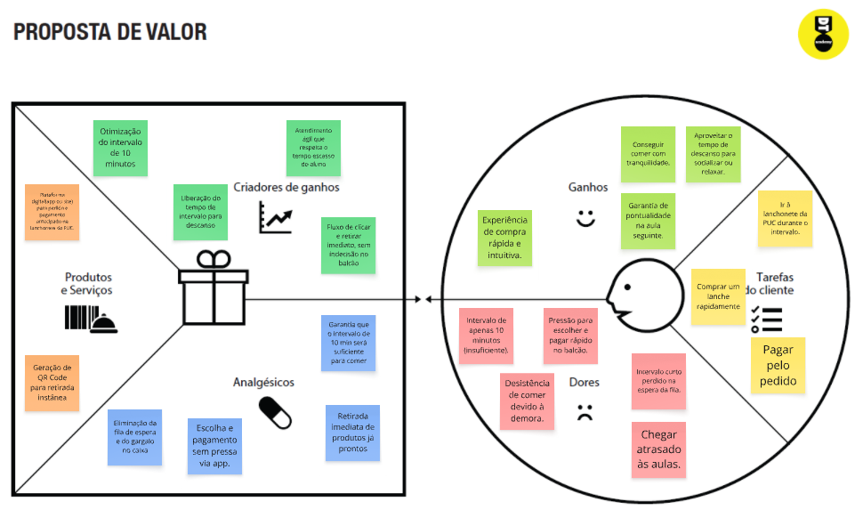
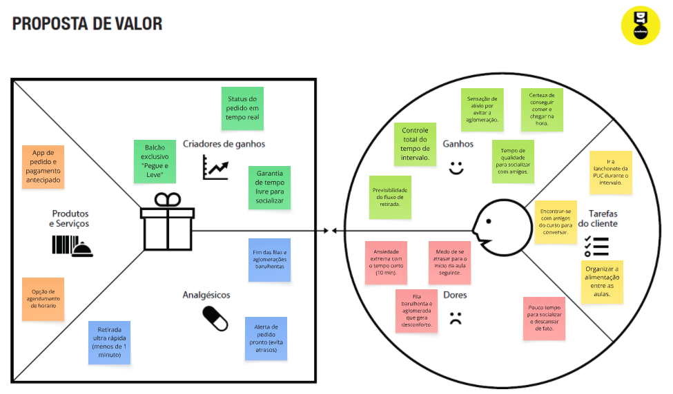
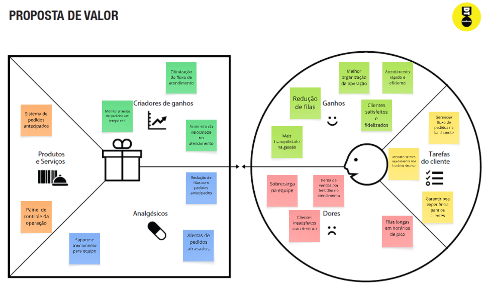

# Product design

Pré-requisitos: <a href="02-Product-discovery.md"> Product discovery</a>

## Histórias de usuários

Com base na análise das personas, foram identificadas as seguintes histórias de usuários:

| EU COMO... `PERSONA` | QUERO/PRECISO ... `FUNCIONALIDADE` | PARA ... `MOTIVO/VALOR` |
| :--- | :--- | :--- |
| **João Vítor** | Realizar pedidos pelo celular | Evitar filas e ganhar tempo no intervalo. |
| **João Vítor** | Retirar meu lanche rapidamente | Comer com tranquilidade antes da próxima aula. |
| **João Vítor** | Acompanhar o status do pedido | Saber quando o lanche estará pronto para busca. |
| **João Vítor** | Um sistema organizado de retirada | Aproveitar melhor meu tempo de descanso no campus. |
| **Maria Eduarda** | Organizar meu tempo no Campus | Evitar estresses com horários e filas extensas. |
| **Maria Eduarda** | Saber que horas meu pedido ficará pronto | Ter mais tranquilidade na rotina acadêmica. |
| **Maria Eduarda** | Evitar aglomerações na lanchonete | Reduzir a ansiedade e ter mais conforto no intervalo. |
| **Maria Eduarda** | Uma interface simples e intuitiva | Fazer pedidos sem dificuldade ou estresse cognitivo. |
| **Carlos Henrique** | Reduzir filas nos horários de pico | Melhorar a experiência dos clientes na lanchonete. |
| **Carlos Henrique** | Controlar os pedidos em tempo real | Garantir uma operação mais eficiente e ágil. |
| **Carlos Henrique** | Aumentar o número de vendas | Melhorar o faturamento e a rentabilidade do negócio. |
| **Carlos Henrique** | Ter acesso a relatórios de desempenho | Tomar decisões gerenciais mais assertivas. |

## Proposta de valor

**✳️✳️✳️ APRESENTE O DIAGRAMA DA PROPOSTA DE VALOR PARA CADA PERSONA ✳️✳️✳️**

##### Persona 1 - Maria Eduarda

##### Persona  2 - João Vítor

##### Persona  3 - Carlos Henrique

## Requisitos

As tabelas a seguir apresentam os requisitos funcionais e não funcionais que detalham o escopo do projeto. Para determinar a prioridade dos requisitos, aplique uma técnica de priorização e detalhe como essa técnica foi aplicada.

### Requisitos funcionais

| ID     | Descrição do Requisito                                   | Prioridade |
| ------ | ---------------------------------------------------------- | ---------- |
| RF-001 | Permitir que o usuário cadastre tarefas ⚠️ EXEMPLO ⚠️ | ALTA       |
| RF-002 | Emitir um relatório de tarefas no mês ⚠️ EXEMPLO ⚠️ | MÉDIA     |

### Requisitos não funcionais

| ID      | Descrição do Requisito                                                              | Prioridade |
| ------- | ------------------------------------------------------------------------------------- | ---------- |
| RNF-001 | O sistema deve ser responsivo para rodar em dispositivos móveis ⚠️ EXEMPLO ⚠️ | MÉDIA     |
| RNF-002 | Deve processar as requisições do usuário em no máximo 3 segundos ⚠️ EXEMPLO ⚠️          | BAIXA      |

> ⚠️ **APAGUE ESTA PARTE ANTES DE ENTREGAR SEU TRABALHO**
>
> Com base nas histórias de usuários, enumere os requisitos da sua solução. Classifique esses requisitos em dois grupos:

- [Requisitos funcionais
 (RF)](https://pt.wikipedia.org/wiki/Requisito_funcional):
 correspondem a uma funcionalidade que deve estar presente na
  plataforma (ex: cadastro de usuário).
- [Requisitos não funcionais
  (RNF)](https://pt.wikipedia.org/wiki/Requisito_n%C3%A3o_funcional):
  correspondem a uma característica técnica, seja de usabilidade,
  desempenho, confiabilidade, segurança ou outro (ex: suporte a
  dispositivos iOS e Android).

Lembre-se de que cada requisito deve corresponder a uma e somente uma característica-alvo da sua solução. Além disso, certifique-se de que todos os aspectos capturados nas histórias de usuários foram cobertos.

> **Links úteis**:
> - [O que são requisitos funcionais e requisitos não funcionais?](https://codificar.com.br/requisitos-funcionais-nao-funcionais/)
> - [Entenda o que são requisitos de software, a diferença entre requisito funcional e não funcional, e como identificar e documentar cada um deles](https://analisederequisitos.com.br/requisitos-funcionais-e-requisitos-nao-funcionais-o-que-sao/)

## Restrições

Enumere as restrições à sua solução. Lembre-se de que as restrições geralmente limitam a solução candidata.

O projeto está restrito aos itens apresentados na tabela a seguir.

|ID| Restrição                                             |
|--|-------------------------------------------------------|
|001| O projeto deverá ser entregue até o final do semestre ⚠️ EXEMPLO ⚠️ |
|002| Não é permitido o desenvolvimento de um módulo de back-end  ⚠️ EXEMPLO ⚠️  |
